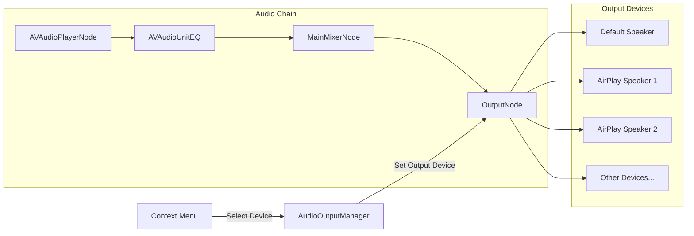

# AirPlay Audio Output Support

## Overview

Add an "Output Device" submenu to the right-click context menu that lists all available audio output devices (including AirPlay speakers). When a device is selected, route the app's audio to that device without affecting system-wide audio settings.

## Research Findings

- **AirPlay devices appear as regular Core Audio output devices** when connected to the same network
- **App-specific routing** is possible via `kAudioOutputUnitProperty_CurrentDevice` on AVAudioEngine's output node audio unit (does not affect system audio)
- **Core Audio HAL APIs** used: `AudioObjectGetPropertyData` for enumeration, `kAudioDevicePropertyDeviceUID` for persistent IDs
- **Device change notifications** via `AudioObjectAddPropertyListener` on `kAudioHardwarePropertyDevices`

## Architecture



## Key Files

- [Sources/AdAmp/Audio/AudioEngine.swift](Sources/AdAmp/Audio/AudioEngine.swift) - Add output device switching
- [Sources/AdAmp/App/ContextMenuBuilder.swift](Sources/AdAmp/App/ContextMenuBuilder.swift) - Add "Output Device" submenu
- **New**: `Sources/AdAmp/Audio/AudioOutputManager.swift` - Manage device discovery and selection

## Implementation

### 1. AudioOutputManager (new file)

Create a manager class using Core Audio APIs:

```swift
// Key Core Audio calls:
AudioObjectGetPropertyData(kAudioObjectSystemObject, &devicesAddress, ...)  // List devices
AudioObjectGetPropertyData(deviceID, &nameAddress, ...)                      // Get device name
AudioObjectGetPropertyData(deviceID, &uidAddress, ...)                       // Get UID for persistence
AudioObjectGetPropertyData(deviceID, &transportAddress, ...)                 // Check if AirPlay
AudioObjectAddPropertyListener(kAudioObjectSystemObject, &devicesAddress, callback, ...) // Watch changes
```

### 2. AudioEngine Changes

Add method to set output device on `engine.outputNode`:

```swift
func setOutputDevice(_ deviceID: AudioDeviceID) {
    let outputUnit = engine.outputNode.audioUnit!
    AudioUnitSetProperty(outputUnit, 
                         kAudioOutputUnitProperty_CurrentDevice,
                         kAudioUnitScope_Global, 0,
                         &deviceID, UInt32(MemoryLayout<AudioDeviceID>.size))
}
```

### 3. Context Menu Integration

Add "Output Device" submenu to [ContextMenuBuilder.swift](Sources/AdAmp/App/ContextMenuBuilder.swift):

- List all available output devices with checkmark on current
- Show device icon/indicator for AirPlay devices
- Menu action calls `AudioEngine.setOutputDevice(deviceID:)`

### 4. Persistence

- Save selected device UID (string) in UserDefaults
- On app launch, find device by UID and set it
- Fall back to system default if saved device unavailable