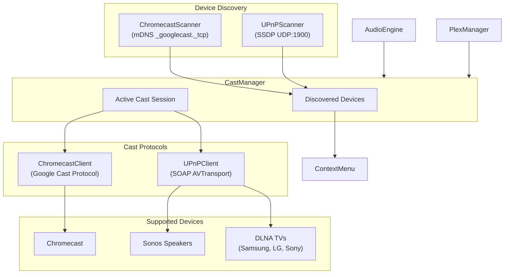

# Casting Support for Chromecast, Sonos, and DLNA TVs

## Overview

Add casting capabilities to stream Plex content to:

- **Chromecast** devices (Google Cast protocol)
- **Sonos** speakers (UPnP/SOAP)
- **DLNA TVs** - Samsung, LG, Sony, and other DLNA-compatible TVs (UPnP/SOAP)

The implementation uses URL-based casting where the cast device fetches audio directly from Plex streaming URLs.

## Architecture



## Implementation Components

### 1. Cast Device Models

Create `Sources/AdAmp/Casting/CastDevice.swift`:

- `CastDeviceType` enum: `.chromecast`, `.sonos`, `.dlnaTV`
- `CastDevice` struct with id, name, type, address/port, manufacturer
- `CastState` enum: `.idle`, `.connecting`, `.connected`, `.casting`

### 2. Chromecast Support

Create `Sources/AdAmp/Casting/ChromecastManager.swift`:

- Use mDNS/Bonjour to discover `_googlecast._tcp` devices (similar to existing AirPlay discovery in [AudioOutputManager.swift](Sources/AdAmp/Audio/AudioOutputManager.swift))
- Implement Google Cast protocol over TLS socket (protobuf messages)
- Key commands: CONNECT, LAUNCH (Default Media Receiver), LOAD (media URL), PLAY, PAUSE, STOP, SEEK

**Dependencies**: Add OpenCastSwift package or implement minimal Cast protocol:

- Device discovery via `NWBrowser` for `_googlecast._tcp`
- TLS connection to device port 8009
- Protobuf-based messaging for media control

**Protocol Scope**:

- Prefer using a vetted Cast library to avoid partial implementations
- If implementing in-house, explicitly scope to Default Media Receiver + basic transport
- Include heartbeat/ping and session lifecycle handling

### 3. UPnP/DLNA Support (Sonos + TVs)

Create `Sources/AdAmp/Casting/UPnPManager.swift`:

Unified UPnP manager that discovers and controls both Sonos speakers and DLNA-compatible TVs.

**SSDP Discovery** - UDP multicast to `239.255.255.250:1900`:

- Sonos: `urn:schemas-upnp-org:device:ZonePlayer:1`
- DLNA TVs: `urn:schemas-upnp-org:device:MediaRenderer:1`

**Device Identification** (from device description XML):

- Parse `manufacturer` field to identify Samsung, LG, Sony, Sonos
- Parse `friendlyName` for display
- Extract `AVTransport` control URL

**Key SOAP Actions** (via AVTransport service):

- `SetAVTransportURI` - Set the media URL to play
- `Play` - Start playback
- `Pause` - Pause playback  
- `Stop` - Stop playback
- `Seek` - Seek to position
- `GetTransportInfo` - Get current playback state
- `GetPositionInfo` - Get current position/duration

**Metadata Requirements**:

- Provide DIDL-Lite metadata with title, artist, and `protocolInfo`
- Some devices reject URLs without valid DIDL-Lite payloads

**Port differences**:

- Sonos: port 1400
- Samsung/LG/Sony TVs: typically port 9197 or from device description

### 4. Unified Cast Manager

Create `Sources/AdAmp/Casting/CastManager.swift`:

- Singleton managing all cast device discovery
- Unified interface for casting regardless of device type
- Track active cast session
- Handle cast session lifecycle
```swift
class CastManager {
    static let shared = CastManager()
    
    var discoveredDevices: [CastDevice] = []
    var activeSession: CastSession?
    
    func startDiscovery()
    func stopDiscovery()
    func cast(to device: CastDevice, url: URL, metadata: CastMetadata)
    func stopCasting()
    func pause()
    func resume()
    func seek(to time: TimeInterval)
}
```


### 5. Plex URL Authorization

Casting devices typically cannot send custom headers, so Plex URLs must include tokens.

- Generate cast-ready URLs with `X-Plex-Token` query parameter
- Track token expiry and refresh URLs when needed
- Ensure URLs are reachable by cast devices on the LAN or via Plex relay
- Add `PlexManager.getCastableStreamURL(for:)` method to generate tokenized URLs for `CastManager`

### 6. Context Menu Integration

Update [ContextMenuBuilder.swift](Sources/AdAmp/App/ContextMenuBuilder.swift):

Add new "Casting" submenu after "Output Device":

```
Casting >
  ├── Chromecast
  │   ├── Living Room TV
  │   └── Bedroom Speaker
  ├── ─────────────
  ├── Sonos
  │   ├── Kitchen
  │   └── Office
  ├── ─────────────
  ├── TVs
  │   ├── Samsung TV [Living Room]
  │   └── LG TV [Bedroom]
  ├── ─────────────
  ├── ✓ Stop Casting (enabled when casting)
  └── Refresh Devices
```

Add `MenuActions` methods:

- `castToDevice(_:)` - Start casting to selected device
- `stopCasting()` - Stop current cast session
- `refreshCastDevices()` - Manually refresh device list

### 7. AudioEngine Integration

Update [AudioEngine.swift](Sources/AdAmp/Audio/AudioEngine.swift):

- When casting is active, pause local playback
- Forward play/pause/stop/seek commands to CastManager
- Sync playback state between local and cast

**State Ownership**:

- CastManager owns playback state when casting is active
- AudioEngine mirrors CastManager state and suppresses local output

### 8. Notifications

Define notifications for UI updates:

- `CastManager.devicesDidChangeNotification`
- `CastManager.sessionDidChangeNotification`
- `CastManager.playbackStateDidChangeNotification`

### 9. Error Handling

Define clear error states and user feedback:

- **Discovery failures**: Show "No devices found" in menu after timeout; offer Refresh option
- **Connection failures**: Display transient error in main window status area; auto-retry once
- **Stream failures**: If cast device reports error mid-playback, pause local state and show error
- **Token expiry**: Refresh URL silently; if refresh fails, stop casting and notify user
- **Device disappears**: Remove from menu on mDNS/SSDP goodbye or timeout; if active session, stop and notify

## macOS Permissions

Local network discovery requires explicit permissions on modern macOS.

- Create `Sources/AdAmp/Resources/Info.plist` with:
  - `NSLocalNetworkUsageDescription` - explanation for local network access prompt
  - `NSBonjourServices` array containing `_googlecast._tcp`
- Document that SSDP uses UDP multicast `239.255.255.250:1900` (no entitlement needed, but firewall may block)

## Package Dependencies

Update [Package.swift](Package.swift) to add:

- Consider `SSDPClient` for UPnP discovery (or implement inline using `NWConnection`)
- OpenCastSwift for Chromecast (or implement minimal protocol)

## Files to Create

- `Sources/AdAmp/Casting/CastDevice.swift` - Models and enums
- `Sources/AdAmp/Casting/CastManager.swift` - Unified manager singleton
- `Sources/AdAmp/Casting/ChromecastManager.swift` - Chromecast discovery and protocol
- `Sources/AdAmp/Casting/UPnPManager.swift` - UPnP/DLNA discovery and SOAP control (Sonos + TVs)
- `Sources/AdAmp/Resources/Info.plist` - App permissions for local network and Bonjour

## Files to Modify

- `Sources/AdAmp/App/ContextMenuBuilder.swift` - Add casting menu
- `Sources/AdAmp/Audio/AudioEngine.swift` - Cast integration
- `Sources/AdAmp/Plex/PlexManager.swift` - Add `getCastableStreamURL(for:)` method
- `Package.swift` - Add dependencies (if using external packages)

## Supported Devices

| Device Type | Discovery | Protocol | Port |

|-------------|-----------|----------|------|

| Chromecast | mDNS `_googlecast._tcp` | Google Cast (TLS/Protobuf) | 8009 |

| Sonos | SSDP `ZonePlayer:1` | UPnP SOAP | 1400 |

| Samsung TV | SSDP `MediaRenderer:1` | UPnP SOAP | varies |

| LG TV | SSDP `MediaRenderer:1` | UPnP SOAP | varies |

| Sony TV | SSDP `MediaRenderer:1` | UPnP SOAP | varies |

## Constraints

- Casting only works with Plex content (HTTP/HTTPS URLs)
- Local files cannot be cast (no local HTTP server)
- Existing AirPlay support in Output Device menu remains unchanged
- DLNA TV support depends on TV having DLNA enabled (some newer models may have it disabled)

## Testing Matrix

- Chromecast: local Plex vs remote Plex, token expiry during playback
- Sonos: DIDL-Lite metadata required vs optional
- DLNA TVs: Samsung/LG/Sony with varying AVTransport support
- Network: discovery on same subnet, device sleep/wake, device disconnects

## Documentation Updates

- Add a casting section to README (supported devices, setup, limitations)
- Include troubleshooting for discovery, tokens, and unsupported devices