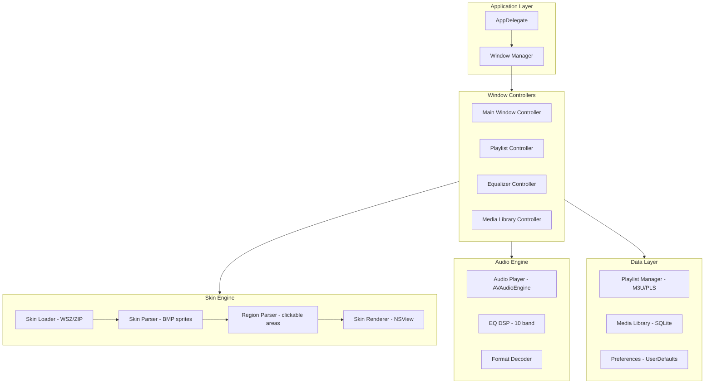

# ClassicAmp - Winamp Clone for macOS

## Detailed Technical Plan

---

## 1. Project Overview

**Goal**: Build a native macOS application that is visually **identical** to Winamp 2.x, with full .wsz skin compatibility.

**Key Requirements**:

- Pixel-perfect rendering of classic Winamp skins
- All classic windows: Main, Playlist, Equalizer, Media Library
- Shade mode for all applicable windows
- Window snapping/docking behavior
- Common audio codec support (MP3, FLAC, AAC, WAV, ALAC, OGG)
- macOS 12+ (Monterey+), Universal Binary (Apple Silicon + Intel)

---

## 2. Architecture Diagram



---

## 3. Winamp Skin Format (.wsz) - Technical Specification

### 3.1 File Structure

A `.wsz` file is a ZIP archive containing BMP sprite sheets and configuration files:

```
skin.wsz (ZIP archive)
├── main.bmp          # Main window background and elements
├── cbuttons.bmp      # Control buttons (play, pause, stop, etc.)
├── monoster.bmp      # Mono/stereo indicators
├── numbers.bmp       # Time display digits (0-9, blank, minus)
├── nums_ex.bmp       # Extended numbers (optional)
├── playpaus.bmp      # Play/pause status indicator
├── posbar.bmp        # Position/seek bar
├── shufrep.bmp       # Shuffle/repeat buttons
├── text.bmp          # Scrolling title font (A-Z, 0-9, symbols)
├── titlebar.bmp      # Title bar elements
├── volume.bmp        # Volume slider
├── balance.bmp       # Balance slider
├── eqmain.bmp        # Equalizer window background
├── eq_ex.bmp         # EQ extras (optional)
├── pledit.bmp        # Playlist editor background
├── pledit.txt        # Playlist colors configuration
├── viscolor.txt      # Visualization colors (21 colors)
├── region.txt        # Window shape regions (optional)
└── cursors/          # Custom cursors (optional)
    ├── normal.cur
    ├── close.cur
    └── ...
```

### 3.2 Main Window Sprite Map (main.bmp)

The main window is **275x116 pixels**. Key sprite regions:

| Element | X | Y | Width | Height | Description |

|---------|---|---|-------|--------|-------------|

| Background | 0 | 0 | 275 | 116 | Main window background |

| Title bar (active) | 27 | 0 | 275 | 14 | Active state |

| Title bar (inactive) | 27 | 15 | 275 | 14 | Inactive state |

| Clutterbar | 0 | 0 | 8 | 43 | Left side options |

| Time display area | 16 | 26 | 63 | 13 | Minutes:seconds display |

| Song title area | 111 | 27 | 154 | 6 | Scrolling marquee |

| Kbps display | 111 | 43 | 15 | 6 | Bitrate |

| kHz display | 156 | 43 | 10 | 6 | Sample rate |

| Mono/Stereo area | 212 | 41 | 56 | 12 | Channel indicator |

### 3.3 Control Buttons (cbuttons.bmp)

Sprite sheet containing button states: **136x36 pixels**

| Button | Normal X | Pressed X | Y | Width | Height |

|--------|----------|-----------|---|-------|--------|

| Previous | 0 | 0 | 0/18 | 23 | 18 |

| Play | 23 | 23 | 0/18 | 23 | 18 |

| Pause | 46 | 46 | 0/18 | 23 | 18 |

| Stop | 69 | 69 | 0/18 | 23 | 18 |

| Next | 92 | 92 | 0/18 | 22 | 18 |

| Eject | 114 | 114 | 0/16 | 22 | 16 |

### 3.4 Numbers Font (numbers.bmp)

Time display digits: **99x13 pixels** sprite strip

- Characters: 0, 1, 2, 3, 4, 5, 6, 7, 8, 9, blank, minus (-)
- Each digit: 9x13 pixels

### 3.5 Text Font (text.bmp)

Scrolling marquee font: **155x18 pixels**

- Row 1 (y=0): A-Z (uppercase)
- Row 2 (y=6): a-z (maps to uppercase) or special chars
- Row 3 (y=12): 0-9 and symbols
- Each character: 5x6 pixels

### 3.6 Playlist Editor (pledit.txt)

Configuration file format:

```ini
[Text]
Normal=#00FF00        ; Normal text color
Current=#FFFFFF       ; Currently playing
NormalBG=#000000      ; Background
SelectedBG=#0000FF    ; Selected item background
Font=Arial            ; Font name (optional)
```

### 3.7 Region Definition (region.txt)

Defines non-rectangular window shapes:

```
NumPoints=4
PointList=0,0,275,0,275,116,0,116
```

---

## 4. Project Structure

```
ClassicAmp/
├── ClassicAmp.xcodeproj
├── ClassicAmp/
│   ├── App/
│   │   ├── AppDelegate.swift
│   │   ├── WindowManager.swift
│   │   └── Info.plist
│   ├── Audio/
│   │   ├── AudioEngine.swift          # AVAudioEngine wrapper
│   │   ├── AudioPlayer.swift          # Playback control
│   │   ├── EQProcessor.swift          # 10-band equalizer DSP
│   │   ├── FormatSupport.swift        # Codec detection
│   │   └── FFmpegBridge/              # Optional extended formats
│   │       ├── FFmpegDecoder.swift
│   │       └── libffmpeg (via SPM)
│   ├── Skin/
│   │   ├── SkinLoader.swift           # Load .wsz ZIP files
│   │   ├── SkinParser.swift           # Parse BMP sprite sheets
│   │   ├── SkinRegion.swift           # Clickable region parsing
│   │   ├── SkinRenderer.swift         # Render sprites to NSView
│   │   ├── SkinElements.swift         # Element definitions
│   │   └── DefaultSkin/               # Bundled default skin
│   │       ├── main.bmp
│   │       ├── cbuttons.bmp
│   │       └── ... (all skin files)
│   ├── Windows/
│   │   ├── MainWindow/
│   │   │   ├── MainWindowController.swift
│   │   │   ├── MainWindowView.swift   # Custom NSView
│   │   │   ├── TimeDisplay.swift      # LED-style digits
│   │   │   ├── Marquee.swift          # Scrolling title
│   │   │   ├── PositionSlider.swift   # Seek bar
│   │   │   ├── VolumeSlider.swift
│   │   │   └── TransportButtons.swift # Play/pause/stop/etc
│   │   ├── Playlist/
│   │   │   ├── PlaylistWindowController.swift
│   │   │   ├── PlaylistView.swift
│   │   │   ├── PlaylistTableView.swift
│   │   │   └── PlaylistItem.swift
│   │   ├── Equalizer/
│   │   │   ├── EQWindowController.swift
│   │   │   ├── EQView.swift
│   │   │   ├── EQSlider.swift         # Vertical band sliders
│   │   │   └── EQPresets.swift
│   │   ├── MediaLibrary/
│   │   │   ├── LibraryWindowController.swift
│   │   │   ├── LibraryView.swift
│   │   │   └── LibrarySidebar.swift
│   │   └── ShadeMode/
│   │       ├── ShadeMainWindow.swift
│   │       └── ShadePlaylist.swift
│   ├── Data/
│   │   ├── PlaylistManager.swift      # M3U/PLS support
│   │   ├── MediaLibrary.swift         # SQLite database
│   │   ├── Migrations/                # Versioned schema migrations
│   │   │   ├── 001_initial.sql
│   │   │   └── ...
│   │   ├── BackupRestore/             # Backup/restore helpers + scripts
│   │   │   ├── BackupService.swift
│   │   │   └── RestoreService.swift
│   │   ├── Preferences.swift
│   │   └── Models/
│   │       ├── Track.swift
│   │       ├── Playlist.swift
│   │       └── EQPreset.swift
│   ├── Utilities/
│   │   ├── BMPParser.swift            # Parse Windows BMP files
│   │   ├── ZIPExtractor.swift         # Extract .wsz files
│   │   ├── ID3Parser.swift            # Metadata extraction
│   │   └── Extensions/
│   │       ├── NSImage+BMP.swift
│   │       └── NSColor+Hex.swift
│   └── Resources/
│       ├── Assets.xcassets
│       ├── DefaultSkin.wsz
│       └── Localizable.strings
├── ClassicAmpTests/
├── Package.swift                       # SPM dependencies
└── README.md
```

---

## 5. Implementation Phases

### Phase 1: Foundation (Week 1-2)

**Goals**: Working audio player with basic UI

#### 1.1 Project Setup

- Create Xcode project with Swift Package Manager
- Configure for macOS 12+, Universal Binary
- Add dependencies:
  - `ZIPFoundation` - for .wsz extraction
  - `SQLite.swift` - for media library
  - `ID3TagEditor` - for metadata
- Establish documentation baseline (README scope, architecture overview, dev setup)

#### 1.2 Audio Engine

```swift
// AudioEngine.swift - Core audio playback
class AudioEngine {
    private let engine = AVAudioEngine()
    private let playerNode = AVAudioPlayerNode()
    private let eqNode = AVAudioUnitEQ(numberOfBands: 10)
    
    var currentTime: TimeInterval { get }
    var duration: TimeInterval { get }
    var isPlaying: Bool { get }
    
    func load(url: URL) throws
    func play()
    func pause()
    func stop()
    func seek(to time: TimeInterval)
    func setVolume(_ volume: Float)  // 0.0 - 1.0
    func setEQBand(_ band: Int, gain: Float)  // -12dB to +12dB
}
```

#### 1.3 Basic Main Window

- Fixed size window (275x116 pixels at 1x scale)
- No standard title bar (custom window chrome)
- Placeholder graphics for initial testing

---

### Phase 2: Skin Engine (Week 3-4)

**Goals**: Full .wsz skin loading and pixel-perfect rendering

#### 2.1 Skin Loader

```swift
// SkinLoader.swift
class SkinLoader {
    func load(from url: URL) throws -> Skin
    func loadDefault() -> Skin
}

struct Skin {
    let main: NSImage           // main.bmp
    let cbuttons: NSImage       // cbuttons.bmp
    let numbers: NSImage        // numbers.bmp
    let text: NSImage           // text.bmp
    let titlebar: NSImage
    let posbar: NSImage
    let volume: NSImage
    let balance: NSImage
    let eqmain: NSImage
    let pledit: NSImage
    let playlistColors: PlaylistColors
    let visColors: [NSColor]
    let regions: WindowRegions?
}
```

#### 2.2 BMP Parser

Windows BMP files have specific quirks:

- Bottom-up row order (flip vertically)
- BGR color order (swap to RGB)
- Row padding to 4-byte boundaries
- Support 8-bit indexed and 24-bit RGB
```swift
// BMPParser.swift
class BMPParser {
    static func parse(data: Data) throws -> NSImage
    static func extractSprite(from image: NSImage, 
                              rect: NSRect) -> NSImage
}
```


#### 2.3 Skin Renderer

```swift
// SkinRenderer.swift
class SkinRenderer {
    private let skin: Skin
    
    // Draw specific elements at their positions
    func drawBackground(in context: CGContext, for window: WindowType)
    func drawButton(_ button: ButtonType, 
                    state: ButtonState, 
                    at point: CGPoint,
                    in context: CGContext)
    func drawTimeDigit(_ digit: Character, 
                       at point: CGPoint,
                       in context: CGContext)
    func drawText(_ text: String,
                  at point: CGPoint,
                  in context: CGContext)
    func drawSlider(_ type: SliderType,
                    value: Float,
                    at point: CGPoint,
                    in context: CGContext)
}
```

#### 2.4 Region-Based Hit Testing

```swift
// SkinRegion.swift
struct ClickableRegion {
    let rect: NSRect
    let action: PlayerAction
}

class RegionManager {
    // Main window click regions (fixed positions from Winamp spec)
    static let mainWindowRegions: [ClickableRegion] = [
        ClickableRegion(rect: NSRect(x: 16, y: 88, width: 23, height: 18),
                        action: .previous),
        ClickableRegion(rect: NSRect(x: 39, y: 88, width: 23, height: 18),
                        action: .play),
        // ... all buttons
    ]
    
    func hitTest(point: NSPoint, in window: WindowType) -> PlayerAction?
}
```

Notes:

- Support multiple polygons in `region.txt` (main/eq/playlist and normal/shade variants)
- Allow composite regions per window and fallback to rectangular bounds when missing

---

### Phase 3: All Windows (Week 5-7)

#### 3.1 Main Window Complete

- All transport controls functional
- Time display with LED-style digits
- Scrolling marquee for track title
- Volume and balance sliders
- Position/seek slider
- Shuffle/repeat toggles
- Minimize, shade, close buttons
- Drag to move window
- Double-click title for shade mode

#### 3.2 Playlist Window

**Size**: 275x116 minimum, resizable vertically

Features:

- Track list with selection
- Current track highlighting
- Add/remove tracks
- Drag to reorder
- Scroll bar (skinned)
- Resize handle
- Mini buttons: Add, Remove, Select, Misc, List
```swift
// PlaylistView.swift
class PlaylistView: NSView {
    var tracks: [Track]
    var currentIndex: Int
    var selectedIndices: Set<Int>
    
    // Skin-aware rendering
    override func draw(_ dirtyRect: NSRect) {
        // Draw pledit.bmp background
        // Draw track list with pledit.txt colors
        // Draw scroll bar from pledit.bmp sprites
    }
}
```


#### 3.3 Equalizer Window

**Size**: 275x116 fixed

Features:

- On/Off toggle
- Auto toggle
- Presets dropdown
- Preamp slider (vertical)
- 10 frequency band sliders (60Hz to 16kHz)
- Visual graph display
```swift
// EQProcessor.swift
class EQProcessor {
    // Standard Winamp EQ frequencies
    static let frequencies: [Float] = [
        60, 170, 310, 600, 1000, 
        3000, 6000, 12000, 14000, 16000
    ]
    
    func setBand(_ index: Int, gain: Float)  // -12 to +12 dB
    func setPreamp(_ gain: Float)
    func loadPreset(_ preset: EQPreset)
}
```


---

### Phase 4: Advanced Features (Week 8-10)

#### 4.1 Media Library Window

- Tree view sidebar (Artists, Albums, Genres)
- Track list view
- Search functionality
- SQLite backend for fast queries
- Automatic folder scanning
- ID3/metadata parsing
 - Versioned schema migrations for every release
 - Backup/restore flow kept in sync with schema versions

#### 4.2 Shade Mode

Compact mode for all windows:

- Main window shade: 275x14 pixels
- Shows: title, time, transport mini-buttons
- Double-click to toggle

#### 4.3 Window Docking/Snapping

Classic Winamp behavior:

- Windows snap together when dragged near each other
- Snap to screen edges
- Move together when docked
- 10-pixel snap threshold
```swift
// WindowManager.swift
class WindowManager {
    var dockedWindows: [[NSWindow]]  // Groups of docked windows
    
    func snapWindow(_ window: NSWindow, to target: NSWindow)
    func moveDockedGroup(startingWith window: NSWindow, by delta: CGPoint)
}
```


#### 4.4 Data Durability

- Migration runner at startup (apply any pending migrations in order)
- Backup/restore scripts updated for each schema change
- Include migration and restore tests for forward/backward compatibility

---

### Phase 5: Polish & Distribution (Week 11-12)

#### 5.1 Extended Format Support

Add FFmpeg bridge for additional codecs:

- OGG Vorbis
- Opus
- WMA (Windows Media Audio)
- APE (Monkey's Audio)
- Module formats (MOD, XM, S3M)

Notes:

- Use a macOS-compatible FFmpeg distribution (universal binary) with a thin Swift wrapper
- Keep the FFmpeg integration optional and feature-flagged for distribution builds

#### 5.2 Keyboard Shortcuts

| Key | Action |

|-----|--------|

| Space | Play/Pause |

| X | Play |

| V | Stop |

| C | Pause |

| Z | Previous |

| B | Next |

| ←/→ | Seek 5 seconds |

| ↑/↓ | Volume |

| L | Load file |

| J | Jump to time |

| Alt+W | Toggle main window |

| Alt+E | Toggle equalizer |

| Alt+P | Toggle playlist |

#### 5.3 Preferences

- Default skin selection
- Audio output device
- Playback options (crossfade, gapless)
- File associations
- Keyboard shortcuts

#### 5.4 Distribution

- Code signing with Developer ID
- Notarization for Gatekeeper
- DMG installer with background image
- Auto-update mechanism (Sparkle framework)

---

## 6. Key Technical Challenges

### 6.1 Pixel-Perfect Rendering

- Must render at exact skin dimensions (275x116 for main window)
- Support Retina displays with @2x scaling
- Custom NSView drawing, not standard controls
- Handle skin transparency (magenta #FF00FF = transparent)
 - Render to an offscreen 1x buffer and scale by integral factors to avoid blur

### 6.2 Window Chrome

- Borderless window (`NSWindow.StyleMask.borderless`)
- Custom drag regions for movement
- Implement resize handles for playlist
- Shadow and layering
```swift
// MainWindowController.swift
class MainWindowController: NSWindowController {
    override func windowDidLoad() {
        window?.styleMask = [.borderless]
        window?.isMovableByWindowBackground = false
        window?.backgroundColor = .clear
        window?.isOpaque = false
        window?.hasShadow = true
        window?.level = .floating  // Optional: always on top
    }
}
```


### 6.3 Real-time Audio EQ

- AVAudioUnitEQ for 10-band parametric EQ
- Map Winamp's -12dB to +12dB range
- Process without audible latency

### 6.4 Legacy BMP Compatibility

- Handle various BMP versions (OS/2, Windows 3.x, etc.)
- Support RLE compression (rare in skins)
- Correct color palette handling for 8-bit BMPs
 - Validate parsing against multiple real-world skins with odd palettes

---

## 7. Dependencies (Swift Package Manager)

```swift
// Package.swift
dependencies: [
    .package(url: "https://github.com/weichsel/ZIPFoundation.git", from: "0.9.0"),
    .package(url: "https://github.com/stephencelis/SQLite.swift.git", from: "0.14.0"),
    .package(url: "https://github.com/chrs1885/ID3TagEditor.git", from: "4.0.0"),
    // Optional: FFmpeg for extended formats (macOS-compatible distribution)
    // Prefer a universal macOS binary with a thin Swift wrapper
]
```

---

## 8. Testing Strategy

### 8.1 Skin Compatibility Testing

- Test with 50+ skins from skins.webamp.org
- Verify pixel-perfect rendering
- Check all UI elements render correctly
- Test edge cases (missing files, corrupt BMPs)
 - Validate region parsing for multi-polygon and window variants

### 8.2 Audio Testing

- Test all supported formats
- Verify gapless playback
- Test EQ frequency response
- Memory/CPU profiling during playback

### 8.3 UI Testing

- Window interactions (drag, resize, dock)
- Keyboard shortcuts
- Menu functionality
- Playlist operations
 - Retina scaling verification (1x rendering scaled to 2x/3x)
 - Backup/restore verification across schema versions

### 8.4 Documentation

- Update README and architecture notes at the end of each phase
- Record schema changes and migration notes in a versioned changelog

---

## 9. Reference Resources

- Webamp source code: https://github.com/captbaritone/webamp (MIT license) - excellent reference for skin parsing
- Winamp Skin Museum: https://skins.webamp.org/ - test skins
- Winamp Skin format documentation: Various community wikis
- XMMS/Audacious source - alternative implementations

---

## 10. Estimated Timeline

| Phase | Duration | Deliverable |

|-------|----------|-------------|

| Phase 1: Foundation | 2 weeks | Working audio player, basic window |

| Phase 2: Skin Engine | 2 weeks | Full .wsz support, pixel-perfect rendering |

| Phase 3: All Windows | 3 weeks | Playlist, EQ, all UI complete |

| Phase 4: Features | 3 weeks | Media library, shade mode, docking |

| Phase 5: Polish | 2 weeks | Extended formats, distribution ready |

| **Total** | **12 weeks** | Full classic Winamp clone |

---

## 11. Success Criteria

1. Load any classic .wsz skin and render it identically to original Winamp
2. All three classic windows (main, playlist, EQ) fully functional
3. Play MP3, FLAC, AAC, WAV, ALAC without issues
4. Window snapping/docking works as expected
5. Runs smoothly on Apple Silicon and Intel Macs
6. Can be distributed to friends via DMG