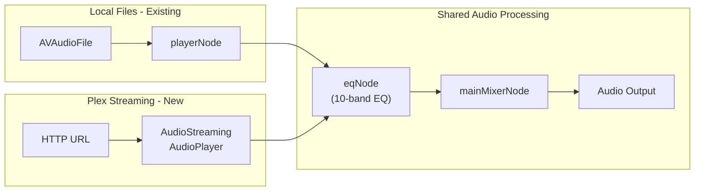

# EQ for Plex Streaming

## Problem

Currently in [AudioEngine.swift](Sources/AdAmp/Audio/AudioEngine.swift):

- **Local files**: Audio flows through `playerNode → eqNode → mainMixerNode` - EQ works
- **Plex streaming**: Uses `AVPlayer` which outputs audio directly to hardware, **completely bypassing AVAudioEngine**. The existing `MTAudioProcessingTap` only analyzes audio for spectrum visualization, it cannot route audio.

### Why the Ring Buffer Approach Failed

The attempted solution (ring buffer bridge between MTAudioProcessingTap and AVAudioSourceNode) failed due to a **fundamental timing mismatch**:

- `MTAudioProcessingTap` (push model): Fires when AVPlayer has decoded audio
- `AVAudioSourceNode` (pull model): Fires when audio hardware needs samples
- These are driven by different clocks and cannot be perfectly synchronized

Even with large buffers (16384 samples ~370ms), the timing drift caused audible distortion.

## Solution: AudioStreaming Library

The proper solution is to **replace AVPlayer** with a library that handles streaming through `AVAudioEngine` internally. The [AudioStreaming](https://github.com/dimitris-c/AudioStreaming) library by dimitris-c does exactly this:

- Handles HTTP streaming, parsing, and decoding
- Uses `AVAudioEngine` internally
- Allows attaching custom `AVAudioNode` (like `AVAudioUnitEQ`)
- Supports both remote URLs and local files
- Handles buffering, reconnection, and format conversion automatically

### Requirements

- **macOS 13.0+** (app currently targets macOS 12 - needs version bump)
- Swift 5.x

## New Architecture



**Note**: Since `AVAudioNode` can only be attached to one engine at a time, we have two options:

1. **Option A**: Use AudioStreaming for ALL audio (replace existing AVAudioEngine)
2. **Option B**: Have separate EQ instances for local and streaming

Option A is cleaner but requires more refactoring. Option B is simpler but means two separate EQ controls (or syncing them manually).

## Implementation Plan

### Phase 1: Add AudioStreaming Dependency

1. **Update Package.swift**:
   ```swift
   platforms: [
       .macOS(.v13)  // Bumped from .v12
   ],
   dependencies: [
       // ... existing ...
       .package(url: "https://github.com/dimitris-c/AudioStreaming.git", from: "0.10.0"),
   ],
   targets: [
       .executableTarget(
           name: "AdAmp",
           dependencies: [
               // ... existing ...
               "AudioStreaming",
           ],
           // ...
       ),
   ]
   ```


### Phase 2: Create StreamingAudioPlayer Wrapper

Create a wrapper class that manages AudioStreaming's AudioPlayer and integrates with existing AudioEngine:

```swift
// Sources/AdAmp/Audio/StreamingAudioPlayer.swift

import Foundation
import AudioStreaming
import AVFoundation

class StreamingAudioPlayer {
    private let player: AudioPlayer
    private let eqNode: AVAudioUnitEQ
    
    // Delegate for state changes
    weak var delegate: StreamingAudioPlayerDelegate?
    
    init() {
        player = AudioPlayer()
        eqNode = AVAudioUnitEQ(numberOfBands: 10)
        setupEQ()
        
        // Attach EQ to the player's audio graph
        player.attach(node: eqNode)
    }
    
    func play(url: URL) {
        player.play(url: url)
    }
    
    func pause() {
        player.pause()
    }
    
    func stop() {
        player.stop()
    }
    
    func seek(to time: TimeInterval) {
        player.seek(to: time)
    }
    
    var currentTime: TimeInterval {
        player.currentTime
    }
    
    var duration: TimeInterval {
        player.duration
    }
    
    var volume: Float {
        get { player.volume }
        set { player.volume = newValue }
    }
    
    // EQ control methods
    func setEQBand(_ band: Int, gain: Float) {
        guard band >= 0 && band < 10 else { return }
        eqNode.bands[band].gain = max(-12, min(12, gain))
    }
    
    func getEQBand(_ band: Int) -> Float {
        guard band >= 0 && band < 10 else { return 0 }
        return eqNode.bands[band].gain
    }
    
    func setPreamp(_ gain: Float) {
        eqNode.globalGain = max(-12, min(12, gain))
    }
    
    func setEQEnabled(_ enabled: Bool) {
        eqNode.bypass = !enabled
    }
    
    private func setupEQ() {
        let frequencies: [Float] = [60, 170, 310, 600, 1000, 3000, 6000, 12000, 14000, 16000]
        for (index, frequency) in frequencies.enumerated() {
            let band = eqNode.bands[index]
            if index == 0 {
                band.filterType = .lowShelf
            } else if index == 9 {
                band.filterType = .highShelf
            } else {
                band.filterType = .parametric
            }
            band.frequency = frequency
            band.bandwidth = index < 5 ? 2.0 : 1.5
            band.gain = 0.0
            band.bypass = false
        }
    }
}
```

### Phase 3: Integrate with AudioEngine

Two integration approaches:

#### Approach A: Parallel Players (Recommended - Less Invasive)

Keep existing `AVAudioEngine` for local files, add `StreamingAudioPlayer` for remote URLs:

```swift
class AudioEngine {
    // Existing for local files
    private let engine = AVAudioEngine()
    private let playerNode = AVAudioPlayerNode()
    private let eqNode = AVAudioUnitEQ(numberOfBands: 10)
    
    // NEW: For streaming
    private var streamingPlayer: StreamingAudioPlayer?
    
    private func loadStreamingTrack(_ track: Track) {
        // Stop local playback
        playerNode.stop()
        audioFile = nil
        isStreamingPlayback = true
        
        // Use streaming player instead of AVPlayer
        if streamingPlayer == nil {
            streamingPlayer = StreamingAudioPlayer()
            streamingPlayer?.delegate = self
        }
        
        // Sync EQ settings from local to streaming player
        syncEQSettings()
        
        streamingPlayer?.play(url: track.url)
        currentTrack = track
    }
    
    // Sync EQ settings when switching between local and streaming
    private func syncEQSettings() {
        guard let sp = streamingPlayer else { return }
        for i in 0..<10 {
            sp.setEQBand(i, gain: eqNode.bands[i].gain)
        }
        sp.setPreamp(eqNode.globalGain)
        sp.setEQEnabled(!eqNode.bypass)
    }
    
    // Update EQ methods to affect both players
    func setEQBand(_ band: Int, gain: Float) {
        guard band >= 0 && band < 10 else { return }
        eqNode.bands[band].gain = max(-12, min(12, gain))
        streamingPlayer?.setEQBand(band, gain: max(-12, min(12, gain)))
    }
}
```

#### Approach B: Unified Player (Cleaner but More Work)

Replace everything with AudioStreaming's AudioPlayer, which handles both local and remote:

```swift
class AudioEngine {
    // Single player for everything
    private let player: AudioPlayer
    private let eqNode: AVAudioUnitEQ
    
    init() {
        player = AudioPlayer()
        eqNode = AVAudioUnitEQ(numberOfBands: 10)
        setupEQ()
        player.attach(node: eqNode)
    }
    
    func loadTrack(at index: Int) {
        let track = playlist[index]
        // Works for both local files and remote URLs
        player.play(url: track.url)
    }
}
```

### Phase 4: Spectrum Analysis

AudioStreaming allows installing taps on the audio graph:

```swift
// Install tap for spectrum analysis
player.frameFiltering = { [weak self] buffer in
    self?.processAudioBuffer(buffer)
}
```

Or use the mainMixerNode tap approach described in the library docs.

### Phase 5: Remove Old AVPlayer Code

Once verified working, remove:

- `streamPlayer: AVPlayer?`
- `audioTap: MTAudioProcessingTap?`
- `tapContext: AudioTapContext?`
- All `MTAudioProcessingTap` callback functions
- `createAudioTapForPlayerItem()`
- `setupAudioTap()`

## Files to Modify

1. **Package.swift** - Add dependency, bump macOS version
2. **Sources/AdAmp/Audio/AudioEngine.swift** - Integrate StreamingAudioPlayer
3. (Optional) **Sources/AdAmp/Audio/StreamingAudioPlayer.swift** - New wrapper class

## Testing Considerations

1. Play Plex track, verify EQ bands affect audio
2. Seek during playback, verify no audio glitches
3. Switch between local and streaming tracks - verify EQ stays in sync
4. Verify spectrum analyzer works for streaming
5. Test volume slider affects streaming audio
6. Test different audio formats (MP3, AAC, FLAC from Plex)
7. Test network interruption/reconnection behavior

## Migration Notes

- **Breaking change**: Requires macOS 13.0+ (users on macOS 12 won't be able to run new version)
- AudioStreaming handles buffering differently than AVPlayer - may need to tune for low-latency or reliability
- Consider keeping AVPlayer as fallback for video content (AudioStreaming is audio-only)

## References

- [AudioStreaming GitHub](https://github.com/dimitris-c/AudioStreaming)
- [SwiftAudioPlayer](https://github.com/tanhakabir/SwiftAudioPlayer) - Alternative library with similar approach