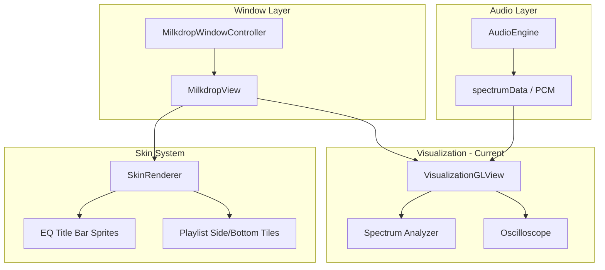

# Milkdrop Visualization Window Implementation

## Overview

A Milkdrop-style visualization window with skinned chrome and real-time audio visualizations. The window follows the same architecture as existing windows (Playlist, PlexBrowser) and integrates with the audio engine.

## Current Implementation (Completed)

The window is fully functional with two built-in visualization modes:

### Features

- **Spectrum Analyzer** - 75-band bar display with green→yellow→red color gradient
- **Oscilloscope** - Real-time waveform display from PCM audio data
- **Skinned Chrome** - Uses EQ title bar sprites and playlist side/bottom tiles
- **Shade Mode** - Collapses to 14px title bar, stops rendering when shaded
- **Fullscreen Support** - Native macOS fullscreen toggle
- **Window Snapping** - Participates in Winamp-style window snapping
- **CVDisplayLink** - 60fps vsync'd rendering with proper lifecycle management

### Controls

- **Space** - Toggle between spectrum analyzer and oscilloscope
- **F** - Toggle fullscreen
- **Double-click title bar** - Toggle shade mode
- **Left/Right arrows** - Preset navigation (stub for future projectM)
- **Right-click** - Context menu with visualization mode selection

### Files Created

- `Sources/AdAmp/Windows/Milkdrop/VisualizationGLView.swift` - OpenGL 3.2 Core view
- `Sources/AdAmp/Windows/Milkdrop/MilkdropView.swift` - Skinned chrome and hit testing
- `Sources/AdAmp/Windows/Milkdrop/MilkdropWindowController.swift` - Window management

### Files Modified

- `SkinElements.swift` - Added `Milkdrop` struct with layout constants
- `SkinRenderer.swift` - Added `drawMilkdropWindow()` and related methods
- `WindowManager.swift` - Added `showMilkdrop()`, `toggleMilkdrop()`, visibility tracking
- `ContextMenuBuilder.swift` - Added Milkdrop menu item
- `AudioEngine.swift` - Added `pcmData` and `pcmSampleRate` properties
- `docs/SKIN_FORMAT_RESEARCH.md` - Added Milkdrop documentation

## Architecture (Current)



## Key Components

### 1. Window Controller

**File:** `Sources/AdAmp/Windows/Milkdrop/MilkdropWindowController.swift`

Following the pattern from [PlaylistWindowController.swift](Sources/AdAmp/Windows/Playlist/PlaylistWindowController.swift):

```swift
class MilkdropWindowController: NSWindowController {
    private var milkdropView: MilkdropView!
    private static let defaultSize = NSSize(width: 400, height: 300)
    private var isShadeMode = false
    
    // Shade mode support
    func setShadeMode(_ enabled: Bool)
    
    // Fullscreen toggle
    func toggleFullscreen()
    
    // Preset cycling
    func nextPreset()
    func previousPreset()
}
```

### 3. Milkdrop View

**File:** `Sources/AdAmp/Windows/Milkdrop/MilkdropView.swift`

The view will contain:

- Title bar area (skinned using playlist sprites like PlexBrowser)
- OpenGL subview for visualization rendering
- Right-click context menu

Key methods following [PlaylistView pattern](docs/PLAYLIST_IMPLEMENTATION_NOTES.md):

- `draw(_:)` - Draw skinned chrome, delegate visualization to OpenGL subview
- `convertToWinampCoordinates(_:)` - For hit testing
- Title bar hit testing for close/shade buttons and window dragging

### 4. OpenGL Visualization View

**File:** `Sources/AdAmp/Windows/Milkdrop/VisualizationGLView.swift`

Subclass of `NSOpenGLView` that:

- Creates OpenGL 4.1 core profile context (macOS maximum)
- Hosts projectM rendering
- Uses CVDisplayLink for 60fps updates
- Receives PCM audio data from AudioEngine
- Stops the display link when the window is hidden, closed, shaded, or enters background mode

### 5. Skin Elements

**Update:** `Sources/AdAmp/Skin/SkinElements.swift`

Add Milkdrop-specific layout constants:

```swift
struct Milkdrop {
    static let minSize = NSSize(width: 275, height: 150)
    static let titleBarHeight: CGFloat = 14  // Match EQ title bar
    
    struct TitleBarButtons {
        static let closeOffset: CGFloat = 11
        static let shadeOffset: CGFloat = 20
    }
}
```

### 6. Skin Renderer

**Update:** `Sources/AdAmp/Skin/SkinRenderer.swift`

Add methods for Milkdrop window chrome:

- `drawMilkdropTitleBar()` - Use EQ title bar sprites with "MILKDROP" text
- `drawMilkdropSideBorders()` - Use playlist side tiles
- Reuse existing close/shade button sprites

### 7. Window Manager Integration

**Update:** `Sources/AdAmp/App/WindowManager.swift`

Add Milkdrop window management:

```swift
private var milkdropWindowController: MilkdropWindowController?

func showMilkdrop()
func toggleMilkdrop()
var isMilkdropVisible: Bool
```

### 8. Audio Data Connection

**Update:** `Sources/AdAmp/Audio/AudioEngine.swift`

The AudioEngine already provides `spectrumData: [Float]` via delegate. For projectM we also need raw PCM data:

- Add a tap to capture PCM samples (reuse `installSpectrumTap` buffer to avoid extra taps)
- Downmix to mono and forward `Float` samples to the visualization
- For streaming playback, use `StreamingAudioPlayer`'s `frameFiltering` buffer to forward PCM data to AudioEngine (similar to spectrum forwarding)
- Add a delegate method (or lightweight observer) for PCM updates so the visualization can subscribe without tying to UI

**Delegate signatures (match existing style):**

```swift
protocol AudioEngineDelegate: AnyObject {
    func audioEngineDidUpdatePCM(_ samples: [Float], sampleRate: Double, channels: Int)
}

protocol StreamingAudioPlayerDelegate: AnyObject {
    func streamingPlayerDidUpdatePCM(_ samples: [Float], sampleRate: Double, channels: Int)
}
```

**Forwarding flow:**

- Local playback: `AudioEngine.processAudioBuffer(_:)` downmixes to mono and calls `audioEngineDidUpdatePCM(...)`
- Streaming playback: `StreamingAudioPlayer.processAudioBuffer(_:)` downmixes to mono and calls `streamingPlayerDidUpdatePCM(...)`
- `AudioEngine` (as `StreamingAudioPlayerDelegate`) forwards `streamingPlayerDidUpdatePCM(...)` to `audioEngineDidUpdatePCM(...)`

### 9. Presets

**Location:** `Sources/AdAmp/Resources/Presets/`

Download and bundle a selection of Milkdrop presets (.milk files) from:

- [Cream of the Crop Pack](https://github.com/projectM-visualizer/presets-cream-of-the-crop)
- Or a smaller curated subset

**Loading notes:**

- Enumerate `.milk` files from `Bundle.module` and sort by filename for stable indexing
- Map preset index to file path for `ProjectM_SetPreset`

## File Structure

```
Sources/AdAmp/
  Visualization/
    ProjectMWrapper.h          (new)
    ProjectMWrapper.mm         (new)
  Windows/
    Milkdrop/
      MilkdropWindowController.swift   (new)
      MilkdropView.swift               (new)
      VisualizationGLView.swift        (new)
  Skin/
    SkinElements.swift         (update - add Milkdrop struct)
    SkinRenderer.swift         (update - add Milkdrop drawing)
  App/
    WindowManager.swift        (update - add milkdrop methods)
    ContextMenuBuilder.swift   (update - add milkdrop menu item)
  Resources/
    Presets/                   (new - .milk preset files)
```

## Implementation Notes

- **OpenGL Deprecation**: macOS deprecated OpenGL but still supports 4.1 core. Use `#define GL_SILENCE_DEPRECATION` in Objective-C++ wrapper.
- **Apple Silicon**: libprojectm v4.1.4+ has fixes for macOS OpenGL compatibility.
- **Context Menu**: Right-click on visualization shows Fullscreen/Desktop Mode/Quit options (matching screenshots).
- **Docking**: Milkdrop window should participate in window snapping but not docking chains (like PlexBrowser).
- **Shade Mode**: Collapse to 14px title bar only.

## Test Plan (Manual) ✓

- [x] Open Milkdrop window from menu; close and reopen without leaks
- [x] Play local track: visualization reacts to audio
- [x] Play Plex streaming track: visualization reacts to audio
- [x] Toggle visualization mode (Space key): spectrum ↔ oscilloscope
- [x] Toggle shade mode: view collapses and resumes rendering correctly
- [x] Toggle fullscreen: GL view resizes, CVDisplayLink remains stable
- [x] Hide/close window: rendering stops (no CPU/GPU burn)
- [x] Window snapping: snaps to main/EQ/playlist windows
- [x] Context menu: right-click shows visualization mode options

## Documentation Updates ✓

Updated `docs/SKIN_FORMAT_RESEARCH.md` with Milkdrop window section documenting:

- Window chrome sprite sources (EQ title bar, playlist side/bottom tiles)
- Layout constants and dimensions
- Button positions and hit testing

---

## Future Enhancement: ProjectM Integration

To add full Milkdrop preset (.milk file) support, the following would be required:

**Files to create:**

- `Sources/AdAmp/Visualization/ProjectMWrapper.h` - C header for Swift interop
- `Sources/AdAmp/Visualization/ProjectMWrapper.mm` - Objective-C++ wrapper for libprojectm

**Build integration:**

- Build libprojectm v4.1.4+ from source (has macOS OpenGL fixes)
- Create a separate SwiftPM Clang target with the wrapper
- Bundle presets from [cream-of-the-crop](https://github.com/projectM-visualizer/presets-cream-of-the-crop)

**Wrapper C API:**

```c
void* ProjectM_Create(int width, int height, const char* presetPath);
void ProjectM_Destroy(void* handle);
void ProjectM_RenderFrame(void* handle);
void ProjectM_AddPCMData(void* handle, float* pcmData, int samples);
void ProjectM_NextPreset(void* handle);
void ProjectM_SetPreset(void* handle, int index);
```

The `VisualizationGLView` already has a `.milkdrop` mode enum case that falls back to spectrum analyzer - this would be updated to call the projectM wrapper when available.