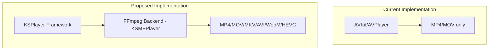

# MKV and Extended Codec Support

## Research Summary

After researching the available options for MKV/codec support on macOS, here are the findings:

| Option | Status | Pros | Cons |

|--------|--------|------|------|

| **KSPlayer** | Active, recommended | Swift-native SPM, auto AVPlayer/FFmpeg switching, macOS views | GPL-3.0 (paid LGPL available) |

| **MPVKit** | Learning-only | SPM support, libmpv power | Not production-ready, complex rendering |

| **VLCKit** | Buggy | Familiar API | Hangs on Sequoia, build issues on newer macOS |

| **Media Extensions** | Limited | Native macOS | No MKV extension exists, macOS 15+ only |

| **libmpv direct** | Complex | Battle-tested (IINA) | Manual C bridging, complex setup |

## Recommended Approach: KSPlayer

**KSPlayer** (kingslay/KSPlayer) is the best fit because:

1. Actively maintained Swift framework with SPM support
2. Automatically uses AVPlayer for native formats (MP4/MOV) and FFmpeg for others (MKV, etc.)
3. Same maintainer as the active FFmpegKit fork
4. Clean Swift API with macOS AppKit views (`MacOSVideoPlayerView`)
5. Supports subtitles, hardware decoding, HDR, multiple audio tracks

## Architecture



Using a single FFmpeg backend for simplicity and consistent behavior across all formats.

## Implementation Steps

### 1. Add KSPlayer Dependency

Update [`Package.swift`](Package.swift):

```swift
dependencies: [
    // existing...
    .package(url: "https://github.com/kingslay/KSPlayer.git", branch: "main"),
],
targets: [
    .executableTarget(
        name: "AdAmp",
        dependencies: [
            // existing...
            "KSPlayer",
        ],
        // ...
    ),
]
```

### 2. Replace VideoPlayerView Implementation

Replace the AVKit-based [`VideoPlayerView.swift`](Sources/AdAmp/Windows/VideoPlayer/VideoPlayerView.swift) with KSPlayer:

```swift
import KSPlayer

class VideoPlayerView: NSView {
    private var playerView: MacOSVideoPlayerView!
    
    func play(url: URL, title: String) {
        // KSPlayer automatically selects AVPlayer or FFmpeg based on format
        let resource = KSPlayerResource(url: url, name: title)
        playerView.set(resource: resource)
    }
}
```

Key changes:

- Replace `AVPlayerView` with `MacOSVideoPlayerView`
- Replace KVO observers with KSPlayer's delegate callbacks
- Keep keyboard shortcuts (space, arrows, escape) with KSPlayer equivalents

### 3. Configure KSPlayer Options

Add configuration for optimal playback in [`VideoPlayerWindowController.swift`](Sources/AdAmp/Windows/VideoPlayer/VideoPlayerWindowController.swift):

```swift
// Configure KSPlayer globally once at app startup - FFmpeg only for consistency
KSOptions.firstPlayerType = KSMEPlayer.self   // Always use FFmpeg backend
KSOptions.secondPlayerType = KSMEPlayer.self  // No AVPlayer fallback
KSOptions.hardwareDecode = true               // Enable hardware acceleration
```

Using FFmpeg-only (single backend) for:

- Consistent behavior across all formats
- Simpler debugging and code paths
- Guaranteed MKV/extended codec support

### 4. Handle Plex Streaming URLs

The existing [`PlexManager.swift`](Sources/AdAmp/Plex/PlexManager.swift) `streamURL(for:)` methods return HTTP URLs. KSPlayer handles these natively with proper HTTP options for Plex URLs:

```swift
var options = KSOptions()
options.appendHeader(["X-Plex-Token": token])  // Attach only for Plex URLs
```

## Window Styling: Skinned Title Bar

The video player will use a **skinned title bar** from `TITLEBAR.BMP` with a black video content area, matching the Winamp aesthetic.

### Title Bar Implementation

Use existing `SkinElements.TitleBar` sprites for window controls:

```swift
// From SkinElements.swift - already defined
struct TitleBar {
    static let active = NSRect(x: 27, y: 0, width: 275, height: 14)
    static let inactive = NSRect(x: 27, y: 15, width: 275, height: 14)
    
    struct Buttons {
        static let closeNormal = NSRect(x: 18, y: 0, width: 9, height: 9)
        static let closePressed = NSRect(x: 18, y: 9, width: 9, height: 9)
        static let minimizeNormal = NSRect(x: 9, y: 0, width: 9, height: 9)
        static let minimizePressed = NSRect(x: 9, y: 9, width: 9, height: 9)
    }
}
```

### VideoPlayerView Structure

```
+------------------------------------------+
|  [Skinned Title Bar - 14px, tiled]   [-][X]|  <- TITLEBAR.BMP sprites
+------------------------------------------+
|                                          |
|                                          |
|         [Black Video Area]               |  <- KSPlayer MacOSVideoPlayerView
|         (KSPlayer content)               |
|                                          |
|                                          |
+------------------------------------------+
```

Key implementation details:

- Title bar uses `SkinRenderer.drawTitleBar()` (already exists)
- Title bar tiles horizontally for windows wider than 275px
- Window controls (close, minimize) use existing button sprites
- Title bar supports window dragging and button hit-testing in the borderless window
- Video content area is black background with KSPlayer embedded
- Window is resizable (title bar tiles, video area scales)

## Files to Modify

- [`Package.swift`](Package.swift) - Add KSPlayer dependency
- [`VideoPlayerView.swift`](Sources/AdAmp/Windows/VideoPlayer/VideoPlayerView.swift) - Replace AVKit with KSPlayer + skinned title bar
- [`VideoPlayerWindowController.swift`](Sources/AdAmp/Windows/VideoPlayer/VideoPlayerWindowController.swift) - Borderless window, KSPlayer config

## License Consideration

This project is open source and accepts KSPlayer's GPL-3.0 license.

## Testing Plan

1. Test local MKV file playback
2. Test Plex movie streaming (various formats)
3. Test Plex TV episode streaming
4. Verify keyboard shortcuts work
5. Verify fullscreen toggle works
6. Test buffering/loading indicator behavior