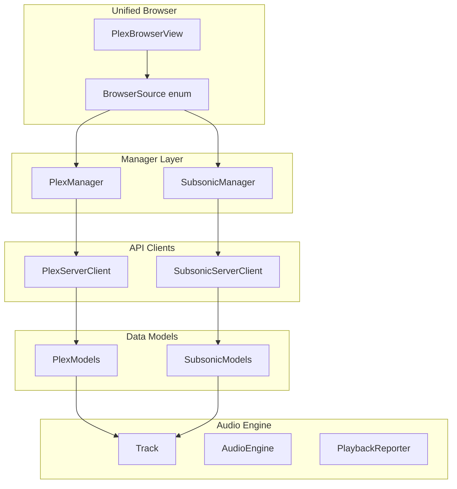

# Navidrome/Subsonic Integration

## Agent Handoff Summary

**Goal:** Add Navidrome/Subsonic server support to AdAmp music player, integrating with the existing unified Library Browser. Follow the established Plex integration patterns.

**Key Decisions Made:**

- Unified browser approach: Add Subsonic as a source option in existing Library Browser (not a separate window)
- Support multiple Subsonic servers (like Plex)
- Full feature set: browsing, playlists, search, favorites/starred, play statistics/scrobbling

**Test Server Running:**

- Location: `tmp/navidrome/` in workspace (binary + config)
- URL: `http://localhost:4533`
- Username: `ad`
- Password: `rdj5cbw8xzu!tyr4FWA`
- Music library: `/Users/ad/Projects/music_service/ARCHIVE`
- Server is running as background process

**Test API call:**

```bash
curl "http://localhost:4533/rest/ping?u=ad&p=rdj5cbw8xzu!tyr4FWA&v=1.16.1&c=AdAmp&f=json"
```

**Implementation Order:**

1. `SubsonicModels.swift` - Data structures
2. `KeychainHelper` extension - Credential storage  
3. `SubsonicServerClient.swift` - API client
4. `SubsonicManager.swift` - State management singleton
5. `Track.swift` extension - Add subsonicId fields
6. `BrowserSource` enum extension - Add .subsonic case
7. `PlexBrowserView` updates - Handle Subsonic sources
8. `SubsonicLinkSheet.swift` - Add server UI
9. `ContextMenuBuilder` - Menu items
10. `SubsonicPlaybackReporter.swift` - Scrobbling
11. `AudioEngine` integration - Report playback
12. Documentation updates

**Reference Files (Plex patterns to follow):**

- `Sources/AdAmp/Plex/PlexManager.swift` - Manager pattern
- `Sources/AdAmp/Plex/PlexServerClient.swift` - API client pattern
- `Sources/AdAmp/Data/Models/PlexModels.swift` - Model DTOs
- `Sources/AdAmp/Windows/PlexBrowser/PlexBrowserView.swift` - BrowserSource enum (line 5-53)

---

## Architecture Overview

The integration follows the existing Plex pattern with parallel components:



## File Structure

New files to create in `Sources/AdAmp/Subsonic/`:

| File | Purpose |

|------|---------|

| `SubsonicManager.swift` | Singleton managing account state, server connections, library data |

| `SubsonicServerClient.swift` | API client for Subsonic REST endpoints |

| `SubsonicModels.swift` | Data models (server, artist, album, track, playlist, etc.) |

| `SubsonicPlaybackReporter.swift` | Scrobbling and play statistics |

| `SubsonicLinkSheet.swift` | Server connection UI (username/password/URL) |

## Key Implementation Details

### 1. Authentication

Subsonic uses token-based authentication with all API calls:

- Generate token: `md5(password + salt)`
- Required params: `u` (username), `t` (token), `s` (salt), `v` (API version), `c` (client name), `f` (format: json)
```swift
// SubsonicServerClient.swift
private func buildRequest(endpoint: String, params: [String: String] = [:]) -> URLRequest? {
    var allParams = params
    allParams["u"] = username
    allParams["t"] = generateToken()  // md5(password + salt)
    allParams["s"] = salt
    allParams["v"] = "1.16.1"
    allParams["c"] = "AdAmp"
    allParams["f"] = "json"
    // Build URL with params...
}
```


### 2. Extend BrowserSource Enum

In [PlexBrowserView.swift](Sources/AdAmp/Windows/PlexBrowser/PlexBrowserView.swift):

```swift
enum BrowserSource: Equatable, Codable {
    case local
    case plex(serverId: String)
    case subsonic(serverId: String)  // NEW
    
    var displayName: String {
        switch self {
        case .subsonic(let serverId):
            if let server = SubsonicManager.shared.servers.first(where: { $0.id == serverId }) {
                return "SUBSONIC: \(server.name)"
            }
            return "SUBSONIC"
        // ... existing cases
        }
    }
}
```

### 3. Extend Track Model

In [Track.swift](Sources/AdAmp/Data/Models/Track.swift):

```swift
struct Track {
    // ... existing properties
    let plexRatingKey: String?
    let subsonicId: String?  // NEW - for scrobbling
    let subsonicServerId: String?  // NEW - to identify which server
}
```

### 4. Extend KeychainHelper

In [KeychainHelper.swift](Sources/AdAmp/Utilities/KeychainHelper.swift):

```swift
private enum Keys {
    // ... existing keys
    static let subsonicServers = "subsonic_servers"  // Array of SubsonicServerCredentials
}

struct SubsonicServerCredentials: Codable {
    let id: String
    let name: String
    let url: String
    let username: String
    let password: String  // Stored encrypted
}
```

### 5. Subsonic API Endpoints to Implement

| Endpoint | Purpose |

|----------|---------|

| `ping` | Test connection |

| `getArtists` | List all artists (indexed) |

| `getArtist` | Get artist details + albums |

| `getAlbum` | Get album details + tracks |

| `getAlbumList2` | Browse albums (by various sorts) |

| `search3` | Full-text search |

| `stream` | Get streaming URL for a track |

| `getCoverArt` | Get album/artist artwork |

| `getPlaylists` | List playlists |

| `getPlaylist` | Get playlist tracks |

| `createPlaylist` / `updatePlaylist` | Playlist management |

| `star` / `unstar` | Favorite tracks/albums |

| `getStarred2` | Get all favorites |

| `scrobble` | Report playback for statistics |

### 6. Menu Integration

In [ContextMenuBuilder.swift](Sources/AdAmp/App/ContextMenuBuilder.swift), add after Plex submenu:

```swift
// Subsonic/Navidrome submenu
menu.addItem(buildSubsonicMenuItem())

private static func buildSubsonicMenuItem() -> NSMenuItem {
    let item = NSMenuItem(title: "Navidrome/Subsonic", action: nil, keyEquivalent: "")
    let submenu = NSMenu()
    
    // Add Server... / Manage Servers
    // Server list with checkmarks
    // Refresh Libraries
    
    item.submenu = submenu
    return item
}
```

### 7. Browser View Modifications

The existing [PlexBrowserView.swift](Sources/AdAmp/Windows/PlexBrowser/PlexBrowserView.swift) needs updates:

1. **Source selector** - Add Subsonic servers to the source dropdown
2. **Content fetching** - Route to `SubsonicManager` when source is `.subsonic`
3. **Track conversion** - Use `SubsonicManager.convertToTrack()` for playback
4. **Artwork loading** - Use Subsonic cover art URLs
5. **Playlists tab** - Fetch from Subsonic when appropriate
6. **Favorites support** - Show starred items, allow starring

### 8. Playback Integration

In `AudioEngine.swift`, extend playback reporting:

```swift
private func reportPlaybackToSubsonic(track: Track, position: TimeInterval) {
    guard let subsonicId = track.subsonicId,
          let serverId = track.subsonicServerId else { return }
    
    SubsonicPlaybackReporter.shared.updatePlayback(
        trackId: subsonicId,
        serverId: serverId,
        position: position
    )
}
```

## Data Model Mapping

| Subsonic | Plex Equivalent | Notes |

|----------|-----------------|-------|

| Artist (id3) | PlexArtist | Use `getArtists` endpoint |

| Album (id3) | PlexAlbum | Use `getAlbum` endpoint |

| Child (song) | PlexTrack | Tracks are "children" in Subsonic |

| Playlist | - | Subsonic has server-side playlists |

| Starred | - | Favorites system unique to Subsonic |

## Testing Considerations

1. Test with both Navidrome and standard Subsonic servers (slight API differences)
2. Test token authentication with various password characters
3. Test streaming with transcoding enabled/disabled
4. Test artwork caching
5. Test scrobbling reports correctly to server

## Documentation Updates

Update these docs after implementation:

- [AGENT_DOCS/AUDIO_SYSTEM.md](AGENT_DOCS/AUDIO_SYSTEM.md) - Add Subsonic streaming section
- [AGENT_DOCS/USER_GUIDE.md](AGENT_DOCS/USER_GUIDE.md) - Add Subsonic setup instructions
- [AGENTS.md](AGENTS.md) - Add Subsonic to key files table