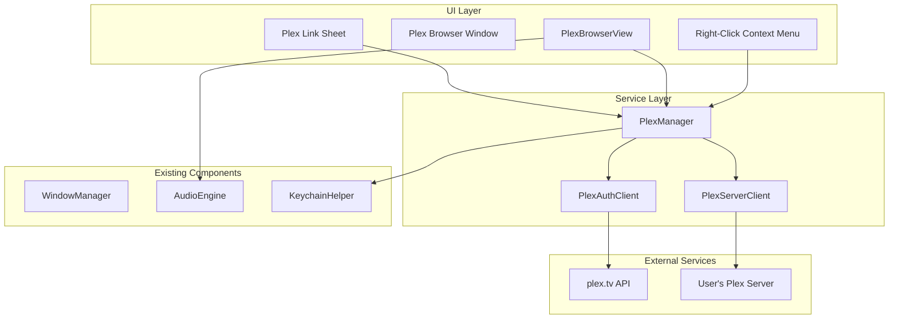
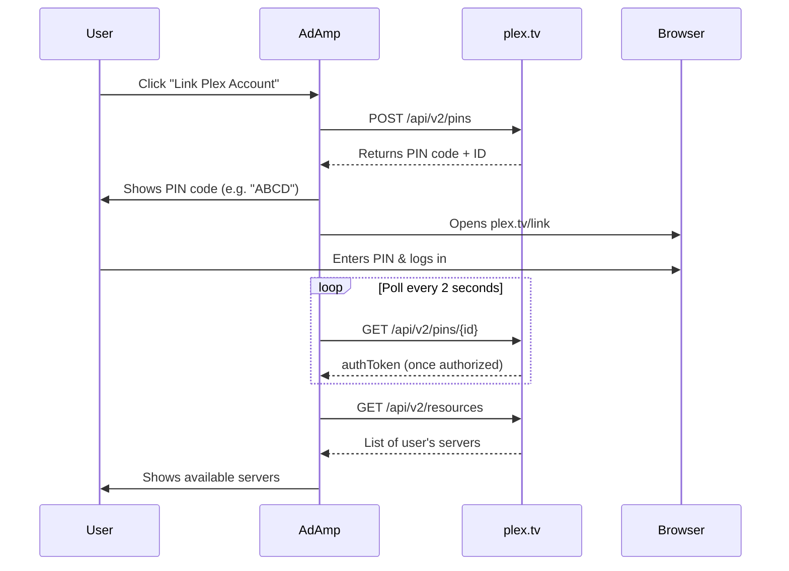

# Plex Music Integration Plan

## Overview

Add comprehensive Plex Media Server integration to AdAmp, enabling users to connect to their Plex servers, browse music libraries, and stream tracks directly. The Plex browser window will match the existing Winamp-style skin theme used by the MediaLibrary, Playlist, and EQ windows.

## Architecture



---

## Plex Authentication - PIN-Based Account Linking

Instead of requiring users to manually find and paste tokens, AdAmp uses the **Plex PIN authentication flow** - the same "Link with code" experience used by smart TVs and streaming devices.

### Authentication Flow



### Plex.tv API Endpoints (Authentication)

| Endpoint | Purpose |

|----------|---------|

| `POST plex.tv/api/v2/pins` | Create a new PIN for linking |

| `GET plex.tv/api/v2/pins/{id}` | Poll PIN status, get authToken when authorized |

| `GET plex.tv/api/v2/resources` | Discover all servers linked to account |

| `GET plex.tv/api/v2/user` | Get current user info |

### Required Headers for plex.tv

```swift
[
    "X-Plex-Client-Identifier": "com.adamp.app",  // Unique, persistent per install
    "X-Plex-Product": "AdAmp",
    "X-Plex-Version": "1.0",
    "X-Plex-Platform": "macOS",
    "X-Plex-Device": "Mac",
    "Accept": "application/json"
]
```

### Required Headers for Plex Media Server

Use the same X-Plex-* headers as plex.tv, plus authentication on each request:

```swift
[
    "X-Plex-Client-Identifier": "com.adamp.app",
    "X-Plex-Product": "AdAmp",
    "X-Plex-Version": "1.0",
    "X-Plex-Platform": "macOS",
    "X-Plex-Device": "Mac",
    "X-Plex-Token": "{token}",
    "Accept": "application/json"
]
```

---

## Plex Media Server API Endpoints

Once authenticated, these endpoints are used on the user's Plex Media Server:

| Endpoint | Purpose |

|----------|---------|

| `GET /library/sections` | List all libraries on server |

| `GET /library/sections/{id}/all?type=8` | List all artists in music library |

| `GET /library/sections/{id}/all?type=9` | List all albums |

| `GET /library/sections/{id}/all?type=10` | List all tracks |

| `GET /library/metadata/{id}/children` | Get children (albums for artist, tracks for album) |

| `GET /photo/:/transcode?...` | Album art thumbnail |

### Streaming URLs

Tracks are streamed via the part key returned by Plex (do not assume file extension):

`{serverURL}{partKey}?X-Plex-Token={token}`

---

## Implementation Details

### 1. Data Models (New File: [`Sources/AdAmp/Data/Models/PlexModels.swift`](Sources/AdAmp/Data/Models/PlexModels.swift))

```swift
/// Plex account (obtained via PIN auth flow)
struct PlexAccount: Codable {
    let authToken: String       // The token received after PIN authorization
    let username: String
    let email: String?
    let thumb: String?          // Avatar URL
}

/// A Plex server discovered from the account
struct PlexServer: Codable, Identifiable {
    let id: String              // Plex's clientIdentifier
    let name: String
    let connection: PlexConnection
    var isOnline: Bool
}

/// Server connection info (local or remote)
struct PlexConnection: Codable {
    let uri: String             // Full URL e.g., "http://192.168.1.100:32400"
    let local: Bool             // true if on same network
    let relay: Bool             // true if using Plex relay
}

struct PlexLibrary: Identifiable {
    let id: String        // Plex section ID
    let name: String
    let type: String      // "artist" for music
    let serverID: String
}

struct PlexArtist: Identifiable {
    let id: String        // ratingKey
    let name: String
    let thumb: String?
    let albumCount: Int
}

struct PlexAlbum: Identifiable {
    let id: String
    let title: String
    let artist: String?
    let year: Int?
    let thumb: String?
    let trackCount: Int
}

struct PlexTrack: Identifiable {
    let id: String
    let title: String
    let artist: String?
    let album: String?
    let duration: Int     // milliseconds
    let trackNumber: Int?
    let partKey: String   // For streaming URL
}
```

### 2. Plex Auth Client (New File: [`Sources/AdAmp/Plex/PlexAuthClient.swift`](Sources/AdAmp/Plex/PlexAuthClient.swift))

Handles PIN-based authentication with plex.tv:

```swift
class PlexAuthClient {
    static let clientIdentifier = "com.adamp.app-\(UUID().uuidString)" // Persist per install
    
    /// Create a new PIN for account linking
    func createPIN() async throws -> PlexPIN
    
    /// Poll PIN status until authorized or expired
    func checkPIN(id: Int) async throws -> PlexPIN
    
    /// Get all servers linked to the account
    func fetchResources(token: String) async throws -> [PlexServer]
    
    /// Get user info
    func fetchUser(token: String) async throws -> PlexAccount
    
    /// Open plex.tv/link in browser for user to authorize
    func openLinkPage(pin: PlexPIN)
}

struct PlexPIN: Codable {
    let id: Int
    let code: String            // 4-character code shown to user
    let authToken: String?      // Populated once user authorizes
    let expiresAt: Date
}
```

### 3. Plex Server Client (New File: [`Sources/AdAmp/Plex/PlexServerClient.swift`](Sources/AdAmp/Plex/PlexServerClient.swift))

Communicates with the user's Plex Media Server:

```swift
class PlexServerClient {
    let server: PlexServer
    let authToken: String
    
    func fetchLibraries() async throws -> [PlexLibrary]
    func fetchArtists(libraryID: String) async throws -> [PlexArtist]
    func fetchAlbums(artistID: String) async throws -> [PlexAlbum]
    func fetchAlbums(forArtist artistID: String) async throws -> [PlexAlbum]
    func fetchTracks(albumID: String) async throws -> [PlexTrack]
    func streamURL(for track: PlexTrack) -> URL
    func artworkURL(thumb: String, size: Int) -> URL?
}
```

### 4. Plex Manager (New File: [`Sources/AdAmp/Plex/PlexManager.swift`](Sources/AdAmp/Plex/PlexManager.swift))

Singleton managing Plex account linking, server discovery, and state.

```swift
class PlexManager {
    static let shared = PlexManager()
    
    // Account state
    private(set) var account: PlexAccount?
    private(set) var isLinked: Bool { account != nil }
    
    // Server state  
    private(set) var servers: [PlexServer] = []
    private(set) var currentServer: PlexServer?
    private(set) var currentLibrary: PlexLibrary?
    
    // Notifications
    static let accountDidChangeNotification = Notification.Name("PlexAccountDidChange")
    static let serversDidChangeNotification = Notification.Name("PlexServersDidChange")
    
    // Account linking (PIN flow)
    func startLinking() async throws -> PlexPIN
    func pollForAuthorization(pinID: Int) async throws -> Bool
    func unlinkAccount()
    
    // Server management
    func refreshServers() async throws
    func connect(to server: PlexServer) async throws
    func selectLibrary(_ library: PlexLibrary)
    
    // Persistence (Keychain for auth token)
    func saveAccount()
    func loadAccount()
}
```

### 5. Plex Browser Window

#### Window Controller (New File: [`Sources/AdAmp/Windows/PlexBrowser/PlexBrowserWindowController.swift`](Sources/AdAmp/Windows/PlexBrowser/PlexBrowserWindowController.swift))

Follow the pattern from [`MediaLibraryWindowController.swift`](Sources/AdAmp/Windows/MediaLibrary/MediaLibraryWindowController.swift):

- Borderless, resizable window
- Integrates with WindowManager for docking/snapping
- Minimum size 400x300

#### Browser View (New File: [`Sources/AdAmp/Windows/PlexBrowser/PlexBrowserView.swift`](Sources/AdAmp/Windows/PlexBrowser/PlexBrowserView.swift))

Follow the visual style from [`MediaLibraryView.swift`](Sources/AdAmp/Windows/MediaLibrary/MediaLibraryView.swift):

```
+------------------------------------------+
|  PLEX BROWSER                      [_][X] |  <- Title bar (gradient)
+------------------------------------------+
| [Server ▼] | [Library ▼]                 |  <- Server/Library selector
+------------------------------------------+
| Artists | Albums | Tracks | Search       |  <- Tab bar
+------------------------------------------+
| ▶ Pink Floyd                    12 albums|  <- Content list
|   ▶ The Dark Side of the Moon   10 tracks|
|     Speak to Me                     1:05 |
|     Breathe                         2:49 |
|     ...                                  |
+------------------------------------------+
| Connected to: MyPlexServer    152 tracks |  <- Status bar
+------------------------------------------+
```

**Colors** (matching existing Winamp theme):

- Background: `RGB(0.08, 0.08, 0.12)`
- Text: Classic green `RGB(0, 0.85, 0)`
- Selected: `RGB(0.15, 0.25, 0.4)`
- Tab selected: `RGB(0.2, 0.2, 0.35)`

### 6. Right-Click Context Menu

Extend the planned [`ContextMenuBuilder.swift`](Sources/AdAmp/App/ContextMenuBuilder.swift) (from existing plan) to add Plex options:

```
Plex → Link Plex Account...        <- Opens PIN linking flow
       Unlink Account              <- Only shown when linked
       ─────────────────
       Servers → ✓ MyHomeServer    <- Server selection
                   OfficeServer
       ─────────────────
       Libraries → ✓ Music         <- Library selection
                     Audiobooks
       ─────────────────
       Show Plex Browser           <- Toggle browser window
```

Context menu states:

- **Not linked**: Only "Link Plex Account..." is enabled
- **Linked**: Shows servers, libraries, and account management options

### 7. Integration with AudioEngine

Modify [`AudioEngine.swift`](Sources/AdAmp/Audio/AudioEngine.swift) to support streaming URLs:

```swift
// Add to AudioEngine
func loadPlexTracks(_ tracks: [PlexTrack], from client: PlexAPIClient) {
    let playableTracks = tracks.map { plexTrack -> Track in
        let streamURL = client.streamURL(for: plexTrack)
        return Track(
            url: streamURL,
            title: plexTrack.title,
            artist: plexTrack.artist,
            album: plexTrack.album,
            duration: TimeInterval(plexTrack.duration) / 1000
        )
    }
    // Prefer metadata-aware load if available; URLs may not contain tags.
    loadFiles(playableTracks.map { $0.url })
}
```

### 8. WindowManager Updates

Add to [`WindowManager.swift`](Sources/AdAmp/App/WindowManager.swift):

```swift
private(set) var plexBrowserWindowController: PlexBrowserWindowController?

func showPlexBrowser() { ... }
func togglePlexBrowser() { ... }
var isPlexBrowserVisible: Bool { ... }
```

---

## File Structure

```
Sources/AdAmp/
├── Plex/
│   ├── PlexAuthClient.swift     # PIN authentication with plex.tv
│   ├── PlexServerClient.swift   # Server API communication
│   ├── PlexManager.swift        # Account & server state management
│   └── PlexModels.swift         # Data models
├── Windows/
│   └── PlexBrowser/
│       ├── PlexBrowserWindowController.swift
│       ├── PlexBrowserView.swift
│       └── PlexLinkSheet.swift  # Account linking UI
└── App/
    └── ContextMenuBuilder.swift  # (extend for Plex menu items)
```

---

## Account Linking UI (PIN Flow)

When user clicks "Link Plex Account...", show a sheet with the linking flow:

```
+--------------------------------------------------+
|  Link Plex Account                               |
+--------------------------------------------------+
|                                                  |
|     To link your Plex account:                   |
|                                                  |
|     1. Go to  plex.tv/link                       |
|                                                  |
|     2. Enter this code:                          |
|                                                  |
|              +---------+                         |
|              |  ABCD   |   <- Large, easy to read|
|              +---------+                         |
|                                                  |
|     Waiting for authorization...   [spinner]    |
|                                                  |
|     [Open plex.tv/link]           [Cancel]      |
+--------------------------------------------------+
```

Once authorized, the sheet automatically:

1. Fetches the user's account info
2. Discovers available servers
3. Closes and shows success notification

---

## Security Considerations

1. Store Plex auth token in macOS Keychain (not UserDefaults)
2. Use unique, persistent client identifier for the app
3. Validate server connections before streaming
4. Clear all credentials on account unlink
5. Handle token expiration gracefully (prompt re-link)

---

## Testing Checklist

- [ ] PIN linking flow opens plex.tv/link
- [ ] PIN code displays correctly in sheet
- [ ] Authorization completes and fetches account
- [ ] Server discovery lists all available servers
- [ ] Connect to server and list music libraries
- [ ] Browse artists, albums, tracks hierarchy
- [ ] Search within library
- [ ] Double-click track to play via streaming
- [ ] Add album/artist to playlist
- [ ] Window snaps/docks with other AdAmp windows
- [ ] Context menu shows correct account/server states
- [ ] Skin colors match existing windows
- [ ] Account persists across app restarts
- [ ] Unlink account clears all credentials
- [ ] Handle offline/unreachable servers gracefully