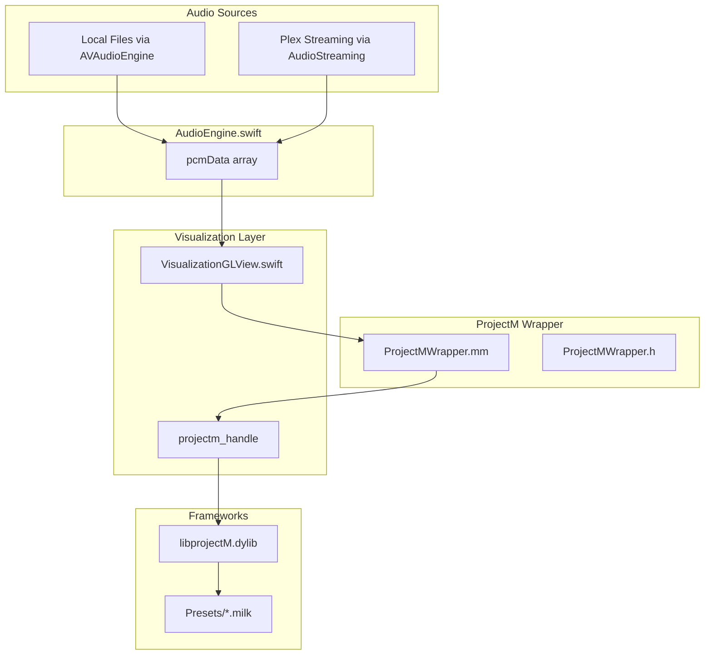

# ProjectM Integration Plan

## Overview

Replace the current spectrum analyzer and oscilloscope visualizations with libprojectM v4.1.6, enabling real Milkdrop preset (.milk file) support. The integration will bundle a pre-built universal library and a curated preset collection.

## Architecture



## Key Files

### New Files

- `Frameworks/libprojectM.dylib` - Universal binary (arm64 + x86_64)
- `Frameworks/libprojectm-4/` - C API headers from projectM v4.1.6
- `Sources/AdAmp/Visualization/ProjectMWrapper.h` - C bridging header for Swift
- `Sources/AdAmp/Visualization/ProjectMWrapper.mm` - Objective-C++ wrapper
- `Sources/AdAmp/Resources/Presets/` - Curated .milk preset files (~100 presets)
- `Sources/AdAmp/Resources/Textures/` - Shared textures for presets

### Modified Files

- [Package.swift](Package.swift) - Add system library target for libprojectM
- [VisualizationGLView.swift](Sources/AdAmp/Windows/Milkdrop/VisualizationGLView.swift) - Replace custom rendering with projectM calls
- [MilkdropView.swift](Sources/AdAmp/Windows/Milkdrop/MilkdropView.swift) - Remove mode switching, simplify to projectM only
- [MilkdropWindowController.swift](Sources/AdAmp/Windows/Milkdrop/MilkdropWindowController.swift) - Connect preset navigation to projectM
- [StreamingAudioPlayer.swift](Sources/AdAmp/Audio/StreamingAudioPlayer.swift) - Add PCM data forwarding for Plex audio
- [AudioEngine.swift](Sources/AdAmp/Audio/AudioEngine.swift) - Add delegate method for streaming PCM

## Implementation Details

### 1. Library Integration

Build libprojectM v4.1.6 from source as a universal binary:

```bash
git clone https://github.com/projectM-visualizer/projectm.git
cd projectm && git checkout v4.1.6
mkdir build && cd build
cmake .. -DCMAKE_OSX_ARCHITECTURES="arm64;x86_64" \
         -DCMAKE_BUILD_TYPE=Release \
         -DprojectM_BUILD_SHARED_LIBS=ON
make
```

Copy `libprojectM.dylib` and `include/projectM-4/` headers to `Frameworks/`.

### 2. Objective-C++ Wrapper

The wrapper exposes a simple C API that Swift can call via bridging header:

```c
// ProjectMWrapper.h
void* ProjectM_Create(int width, int height, const char* presetPath, const char* texturePath);
void ProjectM_Destroy(void* handle);
void ProjectM_RenderFrame(void* handle);
void ProjectM_AddPCMFloat(void* handle, const float* pcmData, unsigned int samples, int channels);
void ProjectM_SetWindowSize(void* handle, int width, int height);
int ProjectM_GetPresetCount(void* handle);
void ProjectM_SelectPreset(void* handle, unsigned int index, bool hardCut);
void ProjectM_SelectNextPreset(void* handle, bool hardCut);
void ProjectM_SelectPrevPreset(void* handle, bool hardCut);
const char* ProjectM_GetPresetName(void* handle, unsigned int index);
```

### 3. VisualizationGLView Changes

Remove all spectrum/oscilloscope code. The `renderFrame()` method becomes:

```swift
private func renderFrame() {
    guard let context = openGLContext, let pmHandle = projectMHandle else { return }
    context.makeCurrentContext()
    CGLLockContext(context.cglContextObj!)
    defer { CGLUnlockContext(context.cglContextObj!) }
    
    // Feed PCM data to projectM
    dataLock.lock()
    let pcm = localPCM
    dataLock.unlock()
    
    pcm.withUnsafeBufferPointer { ptr in
        ProjectM_AddPCMFloat(pmHandle, ptr.baseAddress, UInt32(pcm.count), 1)
    }
    
    // Render frame
    ProjectM_RenderFrame(pmHandle)
    context.flushBuffer()
}
```

### 4. PCM Data for Plex Streaming

Add PCM forwarding in `StreamingAudioPlayer`:

```swift
// In processAudioBuffer(), after spectrum analysis:
// Store PCM samples for visualization
let pcmSize = min(1024, samples.count)
let stride = samples.count / pcmSize
var pcmSamples = [Float](repeating: 0, count: pcmSize)
for i in 0..<pcmSize {
    pcmSamples[i] = samples[i * stride]
}
delegate?.streamingPlayerDidUpdatePCM(pcmSamples)
```

Add delegate method to forward PCM from streaming to AudioEngine's `pcmData` property.

### 5. Preset Management

- Bundle ~100 curated presets from [cream-of-the-crop](https://github.com/projectM-visualizer/presets-cream-of-the-crop)
- Presets stored in `Resources/Presets/`
- Shared textures in `Resources/Textures/`
- Controller calls `ProjectM_SelectNextPreset()` / `ProjectM_SelectPrevPreset()` for navigation

### 6. Package.swift Changes

Add system library target and link configuration:

```swift
.systemLibrary(
    name: "CProjectM",
    pkgConfig: nil,
    providers: []
),
```

And add linker flags to the main target for the bundled dylib.

## Build Instructions

After implementation, users building from source need to:

1. Download pre-built `libprojectM.dylib` from releases (or build from source)
2. Place in `Frameworks/` directory
3. Run `swift build` as normal

## Documentation Updates

- Update `docs/SKIN_FORMAT_RESEARCH.md` Milkdrop section
- Update the plan file to mark projectM tasks complete
- Add build instructions to README for library setup