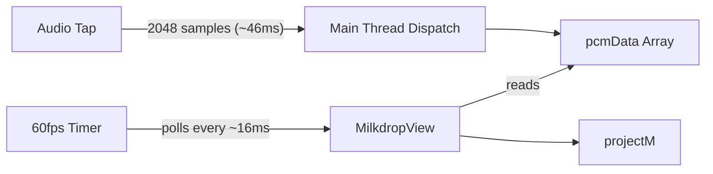
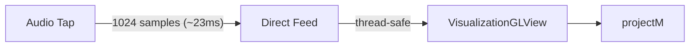

# Reduce Milkdrop Visualization Latency

## Current Data Flow (High Latency)



**Total latency: ~60-80ms**

## Target Data Flow (Low Latency)



**Target latency: ~25-30ms**

## Changes Required

### 1. Reduce FFT Buffer Size

In [AudioEngine.swift](Sources/AdAmp/Audio/AudioEngine.swift), change line 114:

```swift
// From:
private let fftSize: Int = 2048  // ~46ms at 44.1kHz

// To:
private let fftSize: Int = 1024  // ~23ms at 44.1kHz
```

### 2. Remove Timer-Based Polling from MilkdropView

In [MilkdropView.swift](Sources/AdAmp/Windows/Milkdrop/MilkdropView.swift):

- Remove the `displayTimer` property and its setup in `setupView()` (lines 63-66)
- Remove `updateVisualizationData()` method - no longer needed for polling
- Keep the audio active state check but move it to be triggered by notifications

### 3. Add Direct PCM Feed to VisualizationGLView

In [VisualizationGLView.swift](Sources/AdAmp/Windows/Milkdrop/VisualizationGLView.swift):

- The `updatePCM()` method already exists and is thread-safe (uses `dataLock`)
- Ensure it can be called from any thread safely

### 4. Feed PCM Directly from Audio Tap

In [AudioEngine.swift](Sources/AdAmp/Audio/AudioEngine.swift), modify `processAudioBuffer()` (around line 247):

- Instead of just storing to `self.pcmData`, also post a notification or call a delegate method with the PCM data
- Add a weak reference to the visualization view or use NotificationCenter to push data directly

Option A - Use NotificationCenter:

```swift
// Post PCM data notification from audio tap
NotificationCenter.default.post(
    name: .audioPCMDataUpdated,
    object: nil,
    userInfo: ["pcm": samples]
)
```

Option B - Add a dedicated PCM delegate (cleaner):

```swift
protocol AudioVisualizationDelegate: AnyObject {
    func audioEngine(_ engine: AudioEngine, didUpdatePCM samples: [Float])
}
```

### 5. Update MilkdropView to Receive Push Updates

- Subscribe to the PCM notification or implement the delegate
- Forward data immediately to `visualizationGLView.updatePCM()`
- Update audio active state based on playback state changes (use existing delegate)

## Files to Modify

| File | Changes |

|------|---------|

| `Sources/AdAmp/Audio/AudioEngine.swift` | Reduce fftSize, add PCM push mechanism |

| `Sources/AdAmp/Windows/Milkdrop/MilkdropView.swift` | Remove Timer polling, subscribe to PCM updates |

| `Sources/AdAmp/Windows/Milkdrop/VisualizationGLView.swift` | Verify thread safety (likely no changes needed) |

## Testing

1. Play audio and verify visualization responds more quickly to beats
2. Verify no crashes from threading issues
3. Check CPU usage hasn't increased significantly